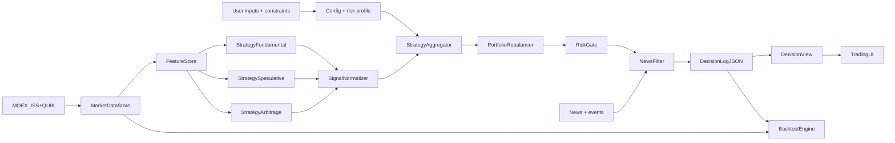

# Trading Advisor Architecture

## Scope and success criteria

This architecture covers an intraday futures trading advisor that evaluates market data,
builds features, runs multiple strategy families (fundamental, speculative, spread
arbitrage), rebalances portfolio proposals, verifies risk constraints, and emits an
immutable decision log plus a UI-friendly projection.

Success criteria:
- Deterministic, reproducible decisions with full input snapshot traceability.
- Risk constraints enforced before any recommendation is presented to the UI.
- Costs and taxes included in decision outputs and backtest parity.
- Backtest outputs match the fields in `decision_log` and `decision_view`.
- Clear module boundaries with explicit contracts and observability.
- StockFuturesSpreadCarryAlpha delivers floor + alpha metrics with early exit logic.
- High-load compute paths (minute replay, backtest sweeps, HPO) use stack-appropriate kernels and scale predictably.

## Compute stack architecture policy

- Layer separation is mandatory:
  - Boundary I/O layer for ingestion/normalization and persistence.
  - Numeric kernel layer for heavy computations.
  - Orchestration layer for sharding, caching, and retries.
- Stack choices:
  - `pandas` at boundaries.
  - `numpy` in hot-path kernels by default.
  - `numba` for profiled numeric hotspots with deterministic fallback.
- Any optimization change must pass both correctness and performance gates.
- Canonical policy details are defined in `docs/architecture/modules/compute-stack-policy.md`.

## Module boundaries

- UserInputs: operator constraints, risk profile, and configuration overrides.
- Data sources: MOEX ISS and QUIK connectors; ingestion and snapshotting only.
- MarketDataStore: immutable, timestamped market data snapshots + metadata.
- FeatureStore: derived features with versioning, input snapshot references.
- StrategyFundamental: valuation, carry, or macro-sensitive signals.
- StrategySpeculative: momentum/mean-reversion/statistical signals.
- StrategyArbitrage: StockFuturesSpreadCarryAlpha (floor carry + early exit) for leg pairs.
- SignalNormalizer: converts module outputs into a consistent strategy signal payload.
- StrategyAggregator: hybrid rules + optimization to merge module intents.
- NewsFilter: event-driven volatility guard; can downweight or block signals.
- PortfolioRebalancer: merges strategy intents and produces target allocations.
- RiskGate: deterministic risk checks and kill-switch enforcement.
- DecisionLog: canonical immutable decision record (`decision_log` schema).
- DecisionView: UI projection (`decision_view` schema).
- TradingUI: operator view with filters and drilldowns to raw log.
- BacktestEngine: replays historical data to produce comparable outputs (legacy + v2 multi-pair engine).
- HPOEngine: hyperparameter optimization over Backtest v2 (walk-forward folds + constraints) with async run/status.
- ForwardTestEngine: paper EOD -> OPEN -> after-close loop with state persistence.

## Agentic vs deterministic steps

| Module | Type | Notes |
| --- | --- | --- |
| Data sources ingestion | Deterministic | Source adapters and normalization. |
| Feature computation | Deterministic | Versioned feature pipelines. |
| StrategyFundamental | Deterministic (by default) | Optional agentic research notes are logged. |
| StrategySpeculative | Deterministic | Pure signal engines. |
| StrategyArbitrage | Deterministic | Explicit spread rules. |
| SignalNormalizer | Deterministic | Canonicalizes strategy outputs and metadata. |
| StrategyAggregator | Deterministic | Rules + optimization, fully auditable. |
| NewsFilter | Agentic + deterministic gates | Classifier can be agentic; gates must be deterministic. |
| PortfolioRebalancer | Deterministic | Weighted aggregation with constraints. |
| RiskGate | Deterministic | Non-negotiable constraints. |
| DecisionView | Deterministic | Projection from `decision_log`. |
| BacktestEngine | Deterministic | Historical replay of same logic. |
| ForwardTestEngine | Deterministic | Paper execution loop with state persistence. |

## Data-flow diagram

## Documentation map

- `docs/architecture/glossary.md`
- `docs/architecture/modules/backend-core.md`
- `docs/architecture/modules/contracts-configs.md`
- `docs/architecture/modules/compute-stack-policy.md`
- `docs/architecture/modules/entities.md`
- `docs/architecture/modules/strategy-signal-interface.md`
- `docs/architecture/modules/stock-futures-spread-carry-alpha.md`
- `docs/architecture/modules/ui-web.md`
- `docs/architecture/layers-v2.md`
- `docs/architecture/entities-v2.md`
- `docs/architecture/architecture-map-v2.md`
- `docs/architecture/architecture-map-d3.html`
- `docs/contracts/api-v2.yaml`
- `docs/ux/workspaces-map.md`
- `docs/research/evaluation-policy.md`
- `docs/runbooks/signal-action-audit.md`
- `docs/user-scenarios.md`

## QC checkpoints and self-correction

- Ingestion QC: schema validation, missing fields, duplicate timestamps.
- Feature QC: feature completeness, NaN/Inf guard, versioning checks.
- Strategy QC: signal bounds, minimum sample size, liquidity thresholds.
- RiskGate QC: strict limit checks with reason codes on failure.
- DecisionLog QC: schema validation, snapshot and feature references present.
- Backtest QC: parity check between backtest output and `decision_log` fields.
- Backtest v2 QC: precompute compatibility checks and deterministic batch scoring for parameter sweeps.
- HPO QC: run_id is persisted, status transitions are monotonic (running -> completed/failed), results attach only on completion, and objective metric/mode selection is respected.

Self-correction rules:
- Retry data ingestion on transient source failures with capped attempts.
- Fallback to last-good snapshot for feature generation (flagged in log).
- Disable strategy module if QC fails and record in `decision_log`.
- Hard stop if RiskGate fails; do not emit actionable UI signals.

## Fallbacks and recovery

- Data source outage: switch to cached snapshots with stale flags.
- QUIK unavailable: operate in read-only mode with MOEX ISS data only.
- NewsFilter failure: default to conservative risk caps and log warning.
- DecisionLog write failure: halt UI updates and surface error state.
- HPO failure: mark run status as failed, persist error message, keep partial results for audit.

## Observability signals

Logs:
- Ingestion latency and snapshot hashes.
- Feature version IDs and missing feature counts.
- Strategy outputs with bounds checks.
- RiskGate decisions with limits and measured values.

Metrics:
- Snapshot freshness, ingestion error rate.
- Feature completeness ratio.
- Strategy activation rates and signal strength distribution.
- RiskGate failure rate and top reasons.
- Backtest parity mismatches.

Traces:
- End-to-end pipeline run with decision_id correlation.

## Contracts and dependencies

- Canonical contracts:
  - `contracts/decision-log.schema.json`
  - `contracts/decision-view.schema.json`
- v2 API surface:
  - `docs/contracts/api-v2.yaml`
- DecisionView is strictly derived from DecisionLog.
- All modules must include snapshot_id references for MOEX ISS/QUIK inputs.

## Backtest and UI alignment

- Backtest metrics include: cagr, sharpe, hit_rate, turnover, and max_drawdown.
- Backtest outputs populate `decision_log.backtest_metrics` and
  `decision_view.backtest_metrics`, and reuse the cost and risk fields from
  `decision_log`.
- Backtest v2 adds multi-pair replay with precomputed snapshots and optional fast alpha
  cache to support large parameter sweeps.
- UI filters: strategy_type, primary_instrument, risk_state, created_at, news_severity.
- UI drilldowns always link back to `decision_id` with full log view.

## Data sources and storage

- MOEX ISS and QUIK ingestion, normalization, and snapshotting are defined in
  `docs/data-sources.md`.
- Snapshot IDs are required in every decision record for reproducibility.

## Baseline assumptions (v0 defaults)

- Account: 1_000_000 RUB, mode=paper, timezone=Europe/Moscow.
- Trading hours: 10:00-18:50 MSK main session; 19:05-23:50 MSK futures evening session.
- Risk profile: max_risk_per_trade_pct=0.5, max_daily_loss_pct=2.0,
  max_open_risk_pct=1.5, max_leverage=3, max_margin_pct=60,
  max_contracts_per_instrument=10, max_positions=6,
  max_correlated_exposure_pct=40, stop_loss_required=true,
  time_stop_minutes=90, slippage_tolerance_ticks=2.
- Instruments:
  - Fundamental: top liquid TQBR equities (SBER, GAZP, LKOH, GMKN, NVTK),
    OFZ-PD bonds (262xx series), metals via MOEX gold/silver futures or ETFs.
  - Speculative futures: RI, Si, BR, GOLD (most liquid FORTS contracts).
  - Spread arbitrage: stock-future pairs for SBER, GAZP, LKOH, GMKN with liquidity gates.
- News filter: lookback_minutes=180, block_severity_threshold=high,
  reduce_severity_threshold=medium, use trusted sources list.
- UI MVP: decision table with decision_id, created_at, strategy_type,
  primary_instrument, action, risk_state, news_severity, cost_summary,
  backtest_metrics; filters for strategy_type, primary_instrument, risk_state,
  created_at, news_severity; drilldown to full decision_log JSON.

## Risks and TODOs

- Confirm cost model parameters per broker/venue.
- Define the exact feature set per strategy family.
- Confirm UI filter list and backtest metric definitions with stakeholders.
